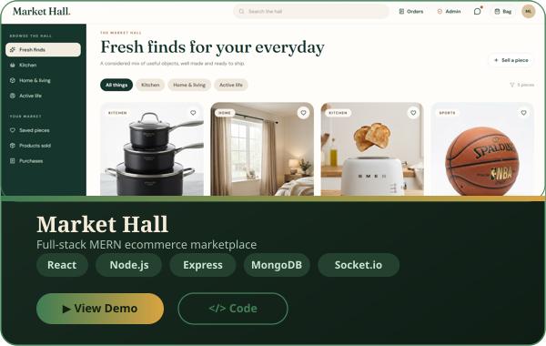
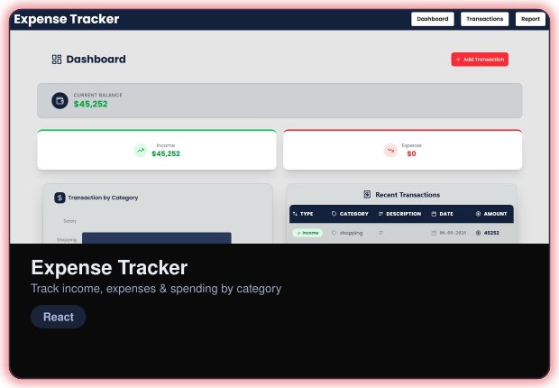
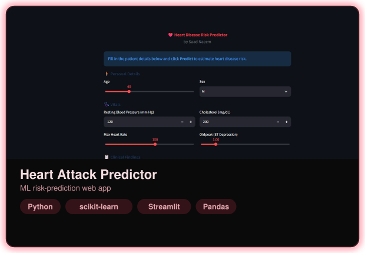

<h1 align="center">Hi there, I'm Saad Naeem 👋</h1>

Full-Stack Web Developer · Learning Machine Learning

---

### 👤 About Me

- 🎓 Computer Science student at **FAST-NUCES, Karachi**
- 🖥️ Full-stack developer working with **RESTful APIs, Node.js, Express & MongoDB** (MERN stack)
- 📊 Learning **Machine Learning** with Python — built and deployed a classifier-based predictor
- 💡 Interested in full-stack + ML-powered applications
- 📫 Reach me at [saadnaeem463@gmail.com](mailto:saadnaeem463@gmail.com)

---

### 🛠️ Tech Stack

**Languages & Frameworks**

**Python and Data Analysis**

**Databases**

**Tools & Platforms**

---

### 🚀 Flagship Projects

